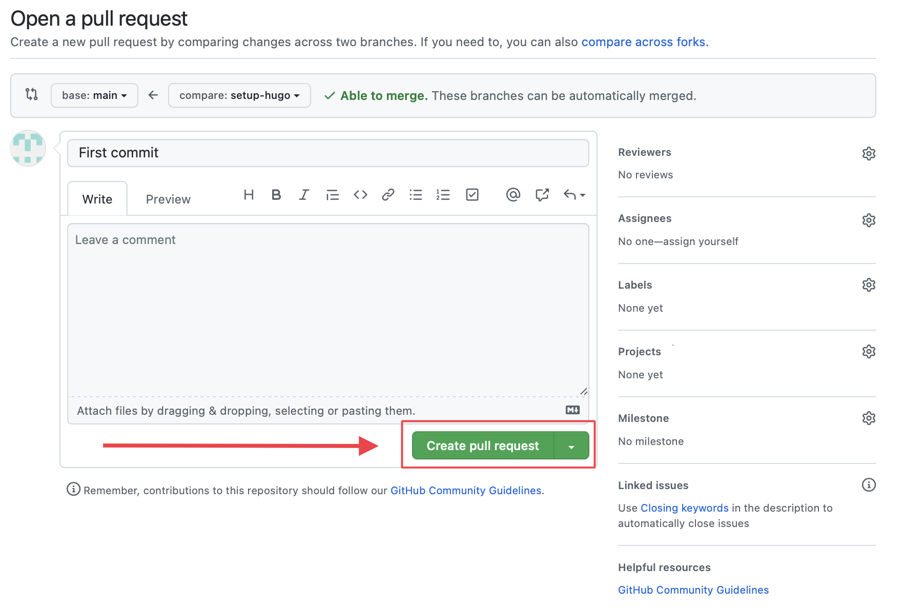
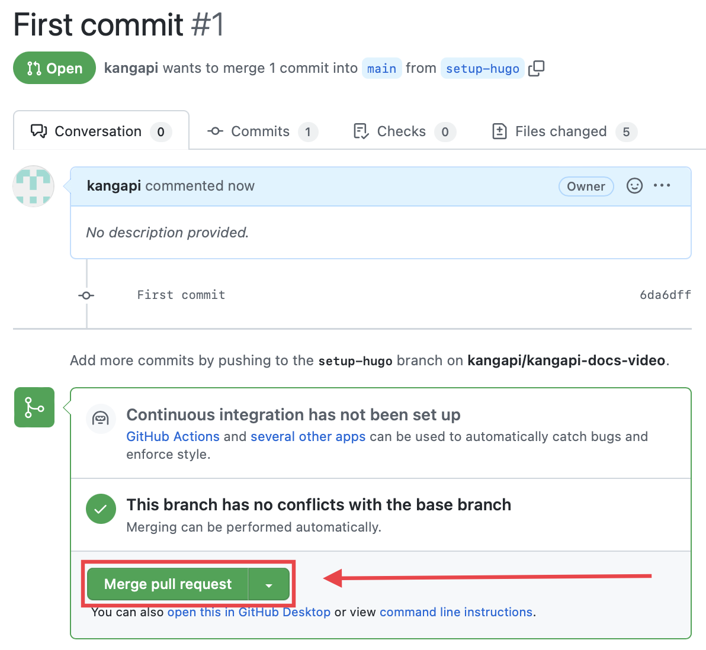
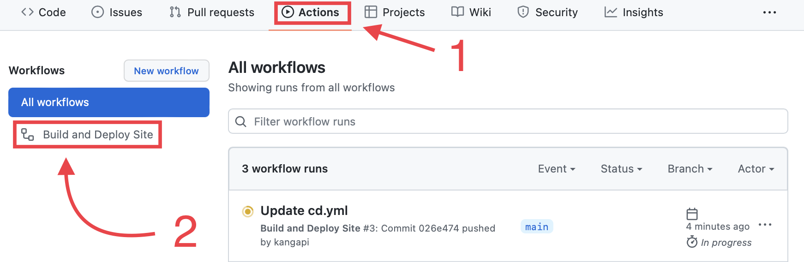
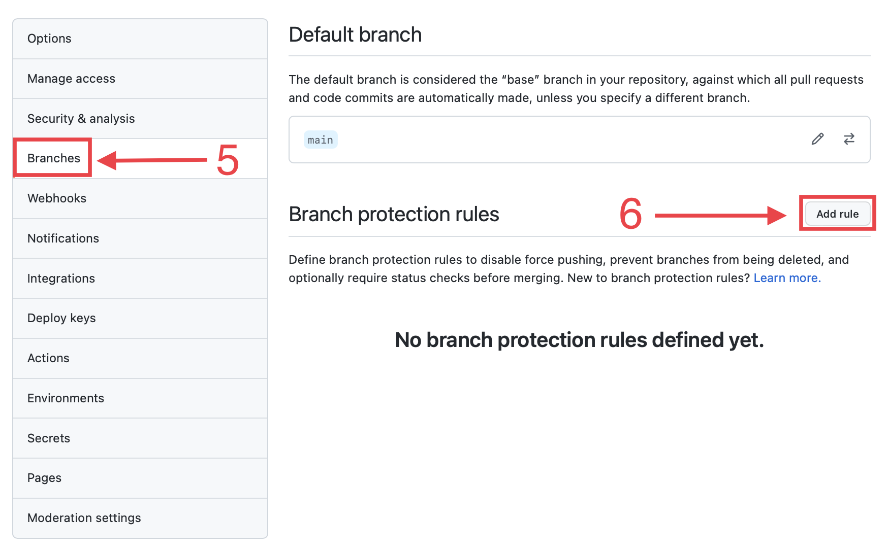
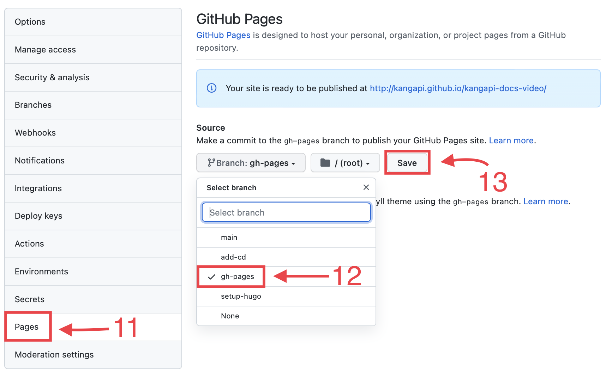
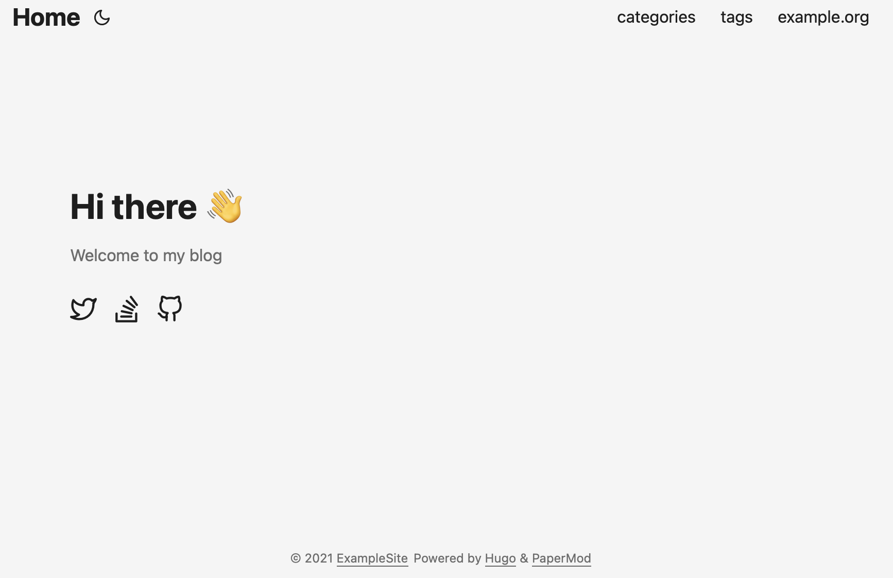

## Intro

- [Hugo](https://gohugo.io) is one of the most popular open-source static site generators.
- [Github Pages](https://pages.github.com) is a static site hosting service that takes HTML, CSS, and JavaScript files straight from a repository on GitHub, optionally runs the files through a build process, and publishes a website.

---

## Create a Github repository

1. Go on the page [new repository](https://github.com/new) on Github.
2. Enter the name of the repository.
3. Select **public** and **add a README file**.
4. Click on **Create Repository**.
5. Copy the repository url.


## Terminal

1. Open the console.
2. Change directory.
    ```
    cd
    ```
3. Clone the repository
    ```
    git clone <repository-url>
    ```
    ```
    Cloning into 'repository-name'...
    remote: Enumerating objects: 3, done.
    remote: Counting objects: 100% (3/3), done.
    remote: Total 3 (delta 0), reused 0 (delta 0), pack-reused 0
    Receiving objects: 100% (3/3), done.
    ```
4. Open the folder that has just been created **in the console**
    ```
    cd <repository-name>
    ```
5. Go a new branch with the name **setup-hugo** for exemple.
    ```
    git checkout -b setup-hugo
    ```
    ```
    Switched to a new branch 'setup-hugo'
    ```
6. Create an Hugo Website with yaml files
    ```
    hugo new site . --force -f yaml
    ```
    ```
    Congratulations! Your new Hugo site is created in .....

    Just a few more steps and you're ready to go:

    1. Download a theme into the same-named folder.
    Choose a theme from https://themes.gohugo.io/ or
    create your own with the "hugo new theme <THEMENAME>" command.
    2. Perhaps you want to add some content. You can add single files
    with "hugo new <SECTIONNAME>/<FILENAME>.<FORMAT>".
    3. Start the built-in live server via "hugo server".

    Visit https://gohugo.io/ for quickstart guide and full documentation.
    ```
7. Add a theme in this tutoriel it's PaperMod
    ```
    git submodule add https://github.com/adityatelange/hugo-PaperMod.git themes/PaperMod --depth=1
    ```
    ```
    Cloning into 'PaperMod/kangapi-docs-video/themes/PaperMod'...
    remote: Enumerating objects: 27650, done.
    remote: Counting objects: 100% (203/203), done.
    remote: Compressing objects: 100% (119/119), done.
    remote: Total 27650 (delta 94), reused 152 (delta 62), pack-reused 27447
    Receiving objects: 100% (27650/27650), 13.80 MiB | 17.23 MiB/s, done.
    Resolving deltas: 100% (14557/14557), done.
    ```
    Needed when you reclone your repo (submodules may not get cloned automatically)
    ```
    git submodule update --init --recursive
    ```
8. Change **config.yaml** replace all to config to this code
   * Don't forget to change the first line which is essential for proper functioning on Github Pages
    ```
    baseURL: "https://<github-username>.github.io/<repository-name>"
    title: ExampleSite
    paginate: 5
    theme: PaperMod

    enableRobotsTXT: true
    buildDrafts: false
    buildFuture: false
    buildExpired: false

    googleAnalytics: UA-123-45

    minify:
        disableXML: true
        minifyOutput: true

    params:
        env: production # to enable google analytics, opengraph, twitter-cards and schema.
        title: ExampleSite
        description: "ExampleSite description"
        keywords: [Blog, Portfolio, PaperMod]
        author: Me
        # author: ["Me", "You"] # multiple authors
        images: ["<link or path of image for opengraph, twitter-cards>"]
        DateFormat: "January 2, 2006"
        defaultTheme: auto # dark, light
        disableThemeToggle: false

        ShowReadingTime: true
        ShowShareButtons: true
        ShowPostNavLinks: true
        ShowBreadCrumbs: true
        ShowCodeCopyButtons: false
        disableSpecial1stPost: false
        disableScrollToTop: false
        comments: false
        hidemeta: false
        hideSummary: false
        showtoc: false
        tocopen: false

        assets:
            # disableHLJS: true # to disable highlight.js
            # disableFingerprinting: true
            favicon: "<link / abs url>"
            favicon16x16: "<link / abs url>"
            favicon32x32: "<link / abs url>"
            apple_touch_icon: "<link / abs url>"
            safari_pinned_tab: "<link / abs url>"

        label:
            text: "Home"
            #icon: /apple-touch-icon.png
            #iconHeight: 35

        # profile-mode
        profileMode:
            enabled: false # needs to be explicitly set
            title: ExampleSite
            subtitle: "This is subtitle"
            imageUrl: ""
            imageWidth: 120
            imageHeight: 120
            imageTitle: my image
            buttons:
                - name: Posts
                  url: posts
                - name: Tags
                  url: tags

        # home-info mode
        homeInfoParams:
            Title: "Hi there \U0001F44B"
            Content: Welcome to my blog

        socialIcons:
            - name: twitter
              url: "https://twitter.com/"
            - name: stackoverflow
              url: "https://stackoverflow.com"
            - name: github
              url: "https://github.com/"

        analytics:
            google:
                SiteVerificationTag: "XYZabc"
            bing:
                SiteVerificationTag: "XYZabc"
            yandex:
                SiteVerificationTag: "XYZabc"

        cover:
            hidden: true # hide everywhere but not in structured data
            hiddenInList: true # hide on list pages and home
            hiddenInSingle: true # hide on single page

        editPost:
            URL: "https://github.com/<path_to_repo>/content"
            Text: "Suggest Changes" # edit text
            appendFilePath: true # to append file path to Edit link

        # for search
        # https://fusejs.io/api/options.html
        fuseOpts:
            isCaseSensitive: false
            shouldSort: true
            location: 0
            distance: 1000
            threshold: 0.4
            minMatchCharLength: 0
            keys: ["title", "permalink", "summary", "content"]
    menu:
        main:
            - identifier: categories
              name: categories
              url: /categories/
              weight: 10
            - identifier: tags
              name: tags
              url: /tags/
              weight: 20
            - identifier: example
              name: example.org
              url: https://example.org
              weight: 30
    # Read: https://github.com/adityatelange/hugo-PaperMod/wiki/FAQs#using-hugos-syntax-highlighter-chroma
    # pygmentsUseClasses: true
    # markup:
    #     highlight:
    #         # anchorLineNos: true
    #         codeFences: true
    #         guessSyntax: true
    #         lineNos: true
    #         style: monokai
    ```
9. Check your site builds by running the below command in your terminal, and then visiting `http://localhost:1313/<repository-name>/`.

## Push to Github

1. Add all files
    ```
    git add .
    ```
2. Commit the current state of our files with a commit description
    ```
    git commit -m "Commit descpription"
    ```
    ```
    [setup-hugo 6da6dff] Commit description
    5 files changed, 144 insertions(+)
    create mode 100644 .gitmodules
    create mode 100644 .hugo_build.lock
    create mode 100644 archetypes/default.md
    create mode 100644 config.yaml
    create mode 160000 themes/PaperMod
    ```
3. Now push our local commit up to the Github server with `git push`
    ```
    git push origin setup-hugo
    ```
    ```
    Enumerating objects: 9, done.
    Counting objects: 100% (9/9), done.
    Delta compression using up to 8 threads
    Compressing objects: 100% (5/5), done.
    Writing objects: 100% (8/8), 2.11 KiB | 2.11 MiB/s, done.
    Total 8 (delta 0), reused 0 (delta 0), pack-reused 0
    remote: 
    remote: Create a pull request for 'setup-hugo' on GitHub by visiting:
    remote:      https://github.com/<github-username>/<github-repository-name>/pull/new/setup-hugo
    remote: 
    To https://github.com/<github-username>/<github-repository-name>.git
    * [new branch]      setup-hugo -> setup-hugo
    ```
4. If we head back onto Github to our repo's page, we should now see a banner informing us that a branch has been updated and providing us with an option to **Compare &pull request**. Click that big green button !

      
      * **Click on the green button that has just appeared**
      
      * **Click on the new button**
      
      * **check if your commit was successfully merged. If so, there should be a purple merged button**
      

5. In your terminal, run the following:
    ```
    git checkout main # Switch back to the main branch
    ```
    ```
    Switched to branch 'main'
    Your branch is up to date with 'origin/main'.
    ```
    ```
    git pull # Pull the changes to the main branch down from Github
    ```
    ```
    remote: Enumerating objects: 1, done.
    remote: Counting objects: 100% (1/1), done.
    remote: Total 1 (delta 0), reused 0 (delta 0), pack-reused 0
    Unpacking objects: 100% (1/1), 623 bytes | 623.00 KiB/s, done.
    From https://github.com/<github-username>/<github-repository-name>
    8de614a..c986a64  main       -> origin/main
    Updating 8de614a..c986a64
    Fast-forward
    .gitmodules           |   3 ++
    .hugo_build.lock      |   0
    archetypes/default.md |   6 +++
    config.yaml           | 134 ++++++++++++++++++++++++++++++++++++++++++++++++++
    themes/PaperMod       |   1 +
    5 files changed, 144 insertions(+)
    create mode 100644 .gitmodules
    create mode 100644 .hugo_build.lock
    create mode 100644 archetypes/default.md
    create mode 100644 config.yaml
    create mode 160000 themes/PaperMod
    ```
## Continous Deployment

#### In this section we will create a workflow that will archieve this for us. It will run on Github Actions

1. Let's start by cheking out a new branch in our local repo
    ```
    git checkout -b add-cd
    ```
    ```
    Switched to a new branch 'add-cd'
    ```
2. Github Actions are automatically triggered by files that are stored in a special folder called `.github/workflows`. So lets create that folder !
    ```
    mkdir -p .github/workflows
    ```
3. Create a `cd.yml`(`cd` is short for **C**ontinous **D**eployment) file inside the `.github/workflows`.
    ```
    touch .github/workflows/cd.yml
    ```
4. Open the `cd.yml` in favorite text editor.

5. Copy and paste into your file.
    ```
    name: Build and Deploy Site

    on:
      push:
        branches:
          - main  # Set a branch to deploy
      pull_request:
        branches:
          - main

    jobs:
      build-and-deploy-site:
        runs-on: ubuntu-latest
        steps:
          - name: Checkout repo
            uses: actions/checkout@v2
            with:
              submodules: true  # Fetch Hugo themes (true OR recursive)
              fetch-depth: 0    # Fetch all history for .GitInfo and .Lastmod

          - name: Setup Hugo
            uses: peaceiris/actions-hugo@v2
            with:
              hugo-version: 'latest'
              extended: true

          - name: Build site with Hugo
            run: hugo --minify

          - name: Check HTML
            uses: chabad360/htmlproofer@master
            with:
              directory: ".public" 
              arguments: --only-4xx --check-favicon --check-html --assume-extension --empty-alt-ignore --disable-external
            continue-on-error: true

          - name: Deploy to Github Pages
            if: github.event_name == 'push' &&  github.ref == 'refs/heads/main'
            uses: peaceiris/actions-gh-pages@v3
            with:
              github_token: ${{ secrets.GITHUB_TOKEN }}
              publish_dir: ./public
    ```
6. Add commit and push the `cd.yml` file to github we did before.
    ```
    git add .github/workflows/cd.yml
    ```
    ```
    git commit -m "Commit-description"
    ```
    ```
    git push origin add-cd
    ```
7. Create a new pull request like the step 4 in [push-to-github](#push-to-github).
      
      * **Click on the green button that has just appeared**
      
      * **Click on the new button**
      
      * **check if your commit was successfully merged. If so, there should be a purple merged button**
      
      1. Go in the **actions** menu.
      2. Click on **Build and Deploy Site**.
      
      3. You should see a **yellow circle**.
      
      4. After less than a minute, you should see the circle in **green**.
      
      5. Go in your repository settings in **Branches**
      6. Click on **Add rule**
      
      7. Enter a branch pattern name
      8. Click on **Require status checks to pass before merging**
      9. Search **build-and-deploy-site** in the list.
      10. Click on **Create** !
      
      11. Now go in **Pages**
      12. Select the **gh-pages** branch
      13. Click on **Save**
      
      14. You should see an amazing website !!!!!
      


8. You can finish with
    ```
    git checkout main
    ```
    ```
    git pull
    ```
9. Exemple Page
    ```
    ---
    title: "My 1st post"
    date: 2020-09-15T11:30:03+00:00
    # weight: 1
    # aliases: ["/first"]
    tags: ["first"]
    author: "Me"
    # author: ["Me", "You"] # multiple authors
    showToc: true
    TocOpen: false
    draft: false
    hidemeta: false
    comments: false
    description: "Desc Text."
    canonicalURL: "https://canonical.url/to/page"
    disableHLJS: true # to disable highlightjs
    disableShare: false
    disableHLJS: false
    hideSummary: false
    searchHidden: true
    ShowReadingTime: true
    ShowBreadCrumbs: true
    ShowPostNavLinks: true
    cover:
        image: "<image path/url>" # image path/url
        alt: "<alt text>" # alt text
        caption: "<text>" # display caption under cover
        relative: false # when using page bundles set this to true
        hidden: true # only hide on current single page
    editPost:
        URL: "https://github.com/<path_to_repo>/content"
        Text: "Suggest Changes" # edit text
        appendFilePath: true # to append file path to Edit link
    ---
    ```
